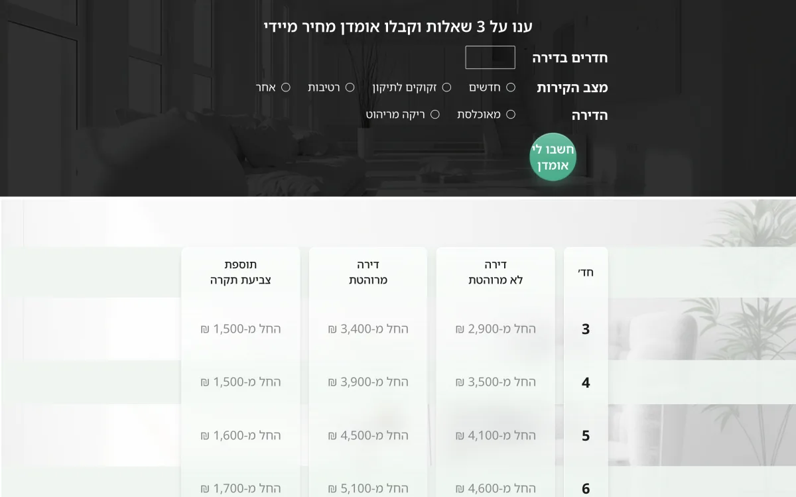
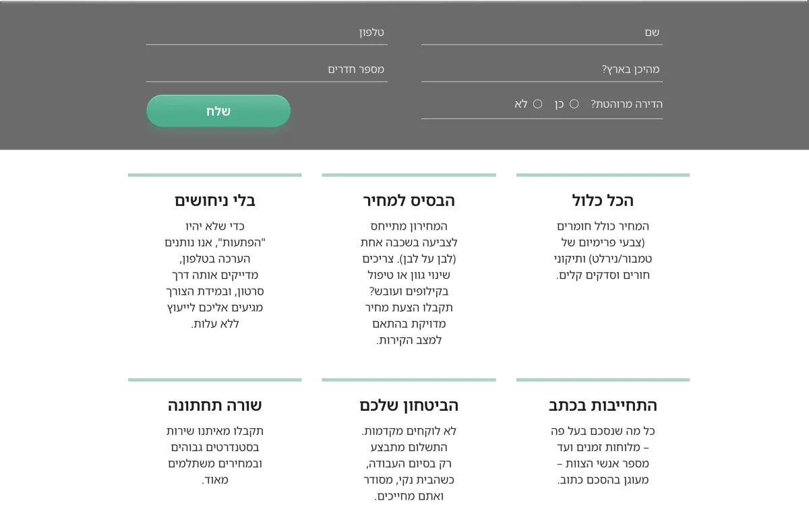

# Tzahi — landing page

**A single-page Hebrew/RTL site for a house-painting contractor in Israel, built for one job: turn a visitor into a lead in the owner's inbox.**

**Live:** [landing-page-tzahi.vercel.app](https://landing-page-tzahi.vercel.app) — this is the public write-up of a private client project.

  

## Signing the lead pipeline from browser to inbox

A submit runs `browser → POST /api/lead` (Vercel, Node ≥ 20) `→ Cloudflare Worker → D1 → Resend`.

The Worker is publicly reachable at `*.workers.dev`, so it cannot trust its caller. Every insert carries a shared `x-worker-secret`, an `x-hmac-timestamp` and an `x-hmac-signature` — HMAC-SHA256 over `${timestamp}.${rawBody}`. The Worker recomputes the MAC over the raw request **text**, not a re-serialized object (re-serializing changes the bytes and silently breaks the MAC), rejects timestamps older than 5 minutes to kill replays, and compares the shared secret with a timing-safe equality check.

Email is never allowed to lose a lead. The Worker writes the row as `email_status='pending'` and returns a `lead_id` **before** Resend is called; a second `POST /status` flips it to `email_sent` or `email_failed`. If Resend fails the lead is already in D1, and `WHERE email_status != 'email_sent'` lists what was missed. No admin dashboard — the owner queries D1 directly.

## Validating the phone number twice and hiding the honeypot from RTL

`^0(5\d|7[2-9])\d{7}$` runs in the browser and again in the Vercel function; both sides normalize to digits first (`replace(/[^0-9]/g,'')`), so dashes and spaces are not punished. Rooms are digit-filtered live and clamped server-side to three characters. Filling the honeypot field `hp` returns `200 {ok:true}` and drops the lead silently, so a bot cannot tell rejection from success.

The honeypot was first hidden with `left:-10000px`, which in an RTL document widened the page and let mobile browsers pinch-zoom out of the design; it now uses the sr-only pattern (`position:absolute`, 1px box, `margin:-1px`) plus `html,body{overflow-x:hidden}`. Mobile type uses `clamp()` rather than baked pixels so the hero holds its two-line layout.

## Estimating the price client-side instead of gating it

A three-question estimator prices 3–6 rooms in the browser from a lookup table mirroring the price table published on the same page — no network call, no form gate. Bigger apartments go to the contact form, not to a fabricated number.

## Shipping the security headers on every response

CSP pins `default-src 'self'` with `object-src`, `frame-ancestors` and `base-uri` at `'none'`, plus a host allowlist per directive for Tag Manager and Ads; `'unsafe-inline'` stays on `script-src` for the GTM snippet, a tag-container cost. With it: HSTS (2 years, `preload`), `X-Frame-Options: DENY`, `nosniff`, `Referrer-Policy: strict-origin-when-cross-origin`, and a `Permissions-Policy` denying camera, mic, geolocation, payment and USB — on every route, not just `/api`.

## Screenshots

  

  

  

## How it was verified

- 2026-05-25 bring-up: 6+ smoke-test leads delivered by email **and** persisted in D1 with `email_status='email_sent'`.
- Live probe: `GET /api/lead` → `405` + `Allow: POST`; `POST` with `{}` → `400 missing_required`. It validates in production, not just in source.
- Headers read off the live response, not trusted from `vercel.json`.

## Stack

`HTML` `CSS` `vanilla JS`, no framework or build step · `Vercel` Node function · `Cloudflare Workers` + `D1` · `Resend` · `Google Tag Manager` (`GTM-5SSBC2DM`), with a `lead_submit` dataLayer push and a `/thanks.html` redirect so the conversion is countable.

Source is private. Built by [@shear559](https://github.com/shear559).
